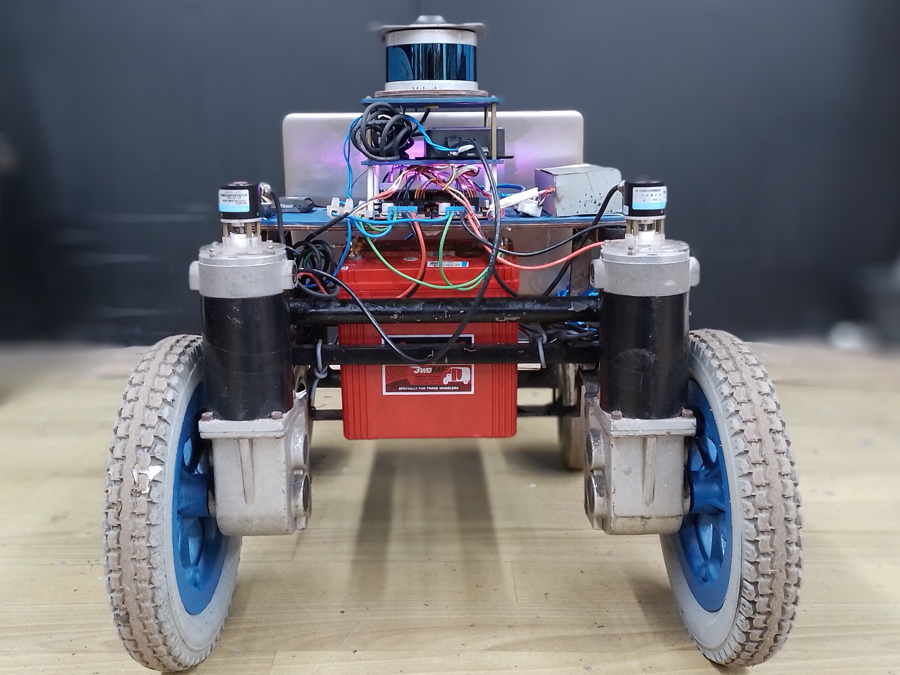
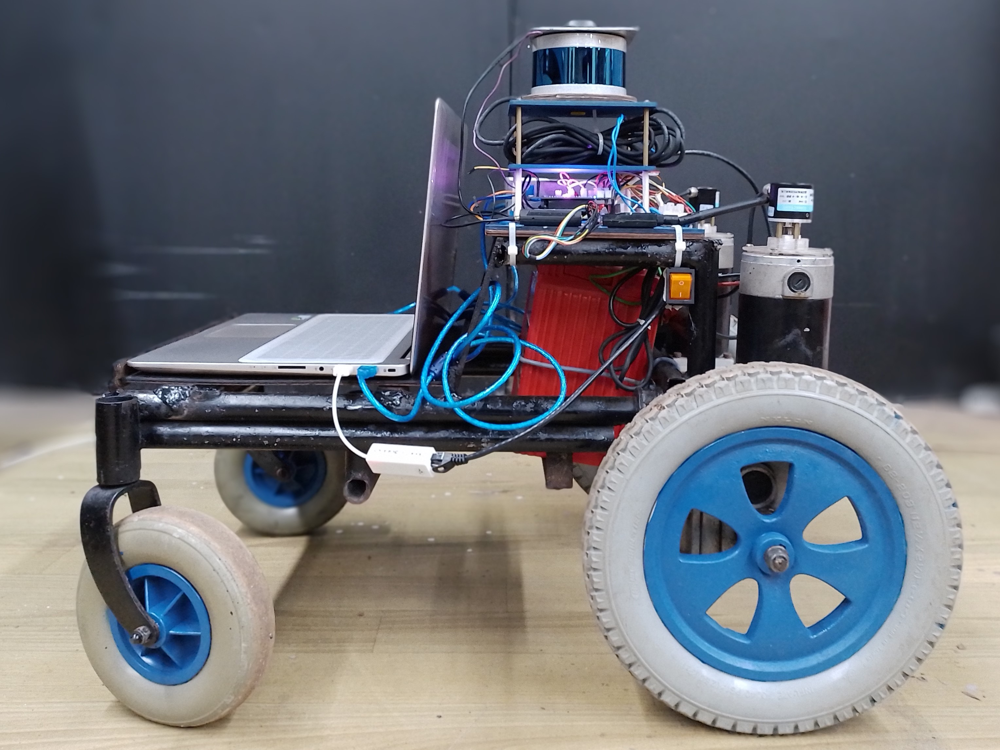
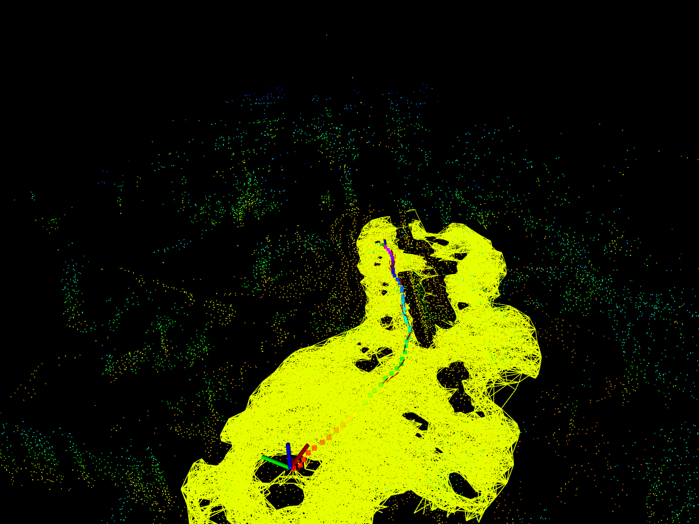
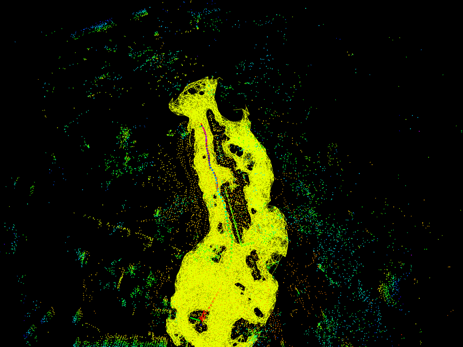
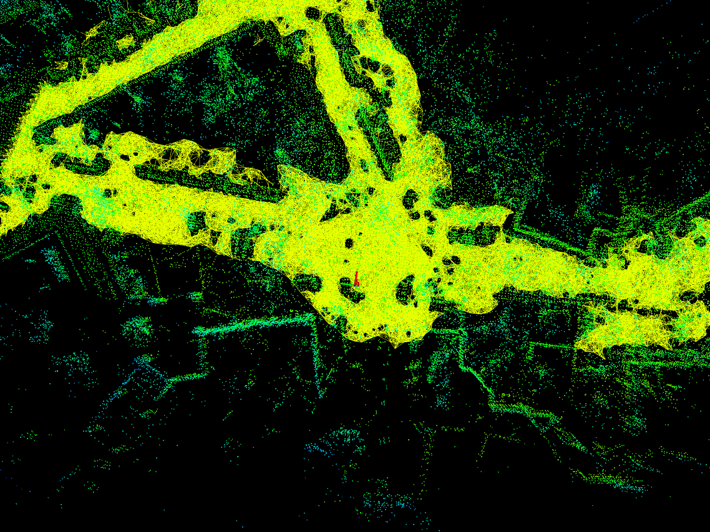
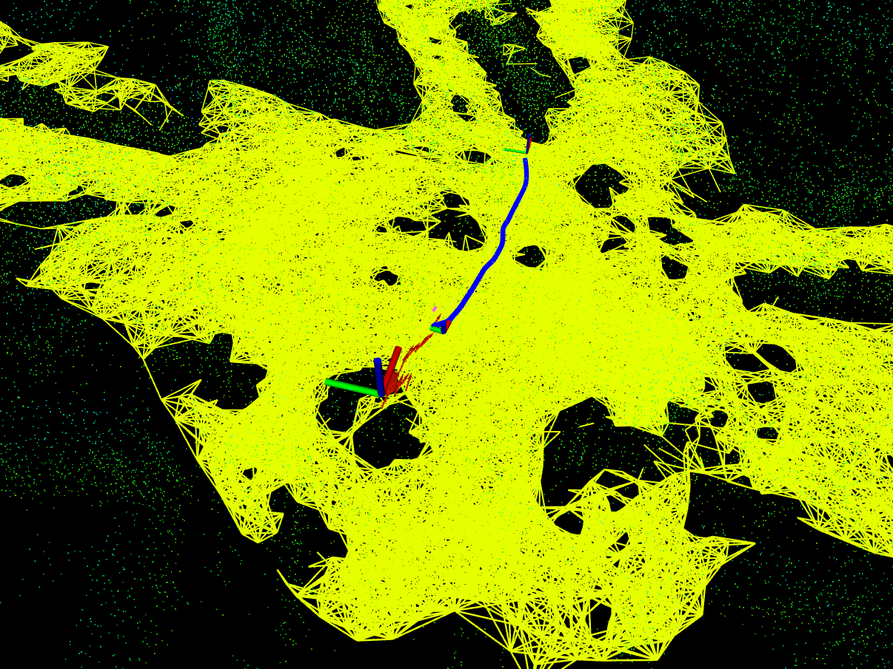
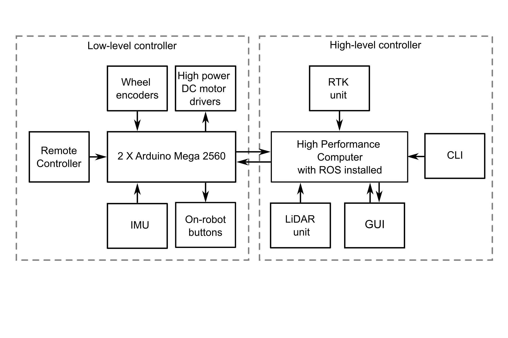

# Introduction

The “Field Robot with Autonomous Navigation” project is a wheeled robot designed to navigate autonomously in semi-structured outdoor environments. The robot uses its perception system to build a 3D representation of the environment and can navigate towards a given goal while taking necessary controlling actions. The robot is entirely battery-powered, with limited weight-carrying capabilities and speed. The robot is built with a *Robot Operating System (ROS)* based software stack. Modularity in the system architecture allows the robot to be modified according to a given application by integrating necessary third-party devices and extending the software stack.

| Front view | Side view |
| --- | --- |
|  |  |

# Design

The robot's functionality is divided into two main phases: the *Mapping Phase* and the *Navigation Phase*.

1. **Mapping Phase**: During this phase, the robot is remotely controlled to capture information about the target outdoor environment. The robot constructs a 3D Point Cloud Map of the environment and a Probabilistic Road Map (PRM) graph that contains information about the traversability of the ground plane.

| Mapping initialization | Bird-eye view of the map being built |
| --- | --- |
|  |  |

2. **Navigation Phase**: In this phase, the robot loads the map information (3D Point Cloud Map and PRM graph) captured during the Mapping Phase. Once a goal location is specified through the Graphical User Interface, the robot plans the shortest and most traversable path to reach that goal. The necessary control commands are then issued to the robot’s low-level controller to safely navigate to the destination.

| Loading the maps | Navigating towards the goal |
| --- | --- |
|  |  |

# System Architecture

The robot consists of two processing units, namely the *Low-Level Controller* and *High-Level Controller*, to carry out the above-mentioned tasks.

- **Low-level Controller**: This consists of two Arduino Mega 2560 devices that control the robot’s motors and interface with Wheel Encoder and Inertial Measurement Unit (IMU) sensor.
- **High-level Controller**: This is a high-performance laptop that performs computationally expensive tasks such as mapping and navigation. It is also responsible for controlling the low-level controller unit.

# Potential Application Areas

- Precision agriculture robots in outdoor environments
- Autonomous Security Robots (ASRs)
- Autonomous carts (lawnmowers, golf buggies, resort transportation)
- Disaster management robots in semi-structured environments
- Research platform to test models and algorithms used in autonomous field robots

# Affiliation

**Institution**: Electronic and Telecommunication Engineering Department - University of Moratuwa, Sri Lanka 
**Supervisor**: Prof. Rohan Munasinghe 
**Team**:  
  - Thalagala B. P.  
  - Vithurabiman S.
  - Udugamakorala G. D.
  - Nagasinghe K. R. Y.
